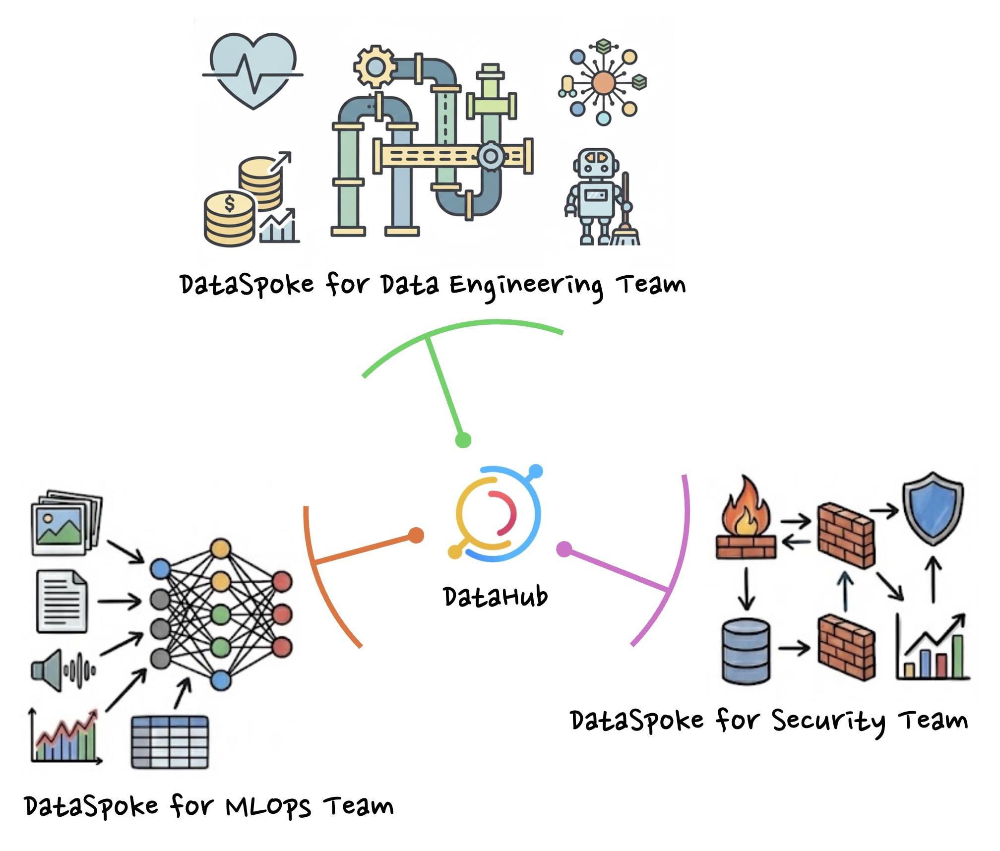

# DataSpoke Baseline

AI Data Catalog Starter: Productized Scaffold for Custom Solutions

---

## 1. Problem Statement

### New Requirements for Data Catalogs in the AI Era

As LLMs and AI Agents become deeply embedded in real-world workflows, data catalogs must go beyond simple metadata repositories and support two critical capabilities:

* **Online Verifier**: Real-time validation of pipeline development outputs within AI coding loops.
* **Self-Purification**: AI-driven design of data ontologies, with autonomous consistency checks and corrections.

### The Limits of Monolithic Catalogs

Platforms like DataHub, Dataplex, and OpenMetadata offer vast feature sets, yet their real-world adoption remains low. The root cause: trying to serve everyone, they end up optimized for no one.

* **Diverging user needs**: Data engineers want anomaly signals in pipelines; analysts want trusted tables fast; security teams want PII visibility. Despite having different purposes, everyone is forced into a single view.
* **Functional gaps**: Legacy and unstructured data sources outside standard connectors, quality checks stuck at static validation — the actual demands of operations are far more specific than what existing platforms can accommodate.

### Goals

This project pursues two goals:

1. **Baseline Product**: Define and implement the essential features any AI-era data catalog must have.
2. **Scaffold for AI Coding**: Provide sufficient conventions, development specs, and Claude Code utilities so that an organization-specific dedicated catalog can be built with AI in a short time.

The name **DataSpoke** comes from treating the existing DataHub as the Hub, and defining each specialized extension tailored to an organization's needs as a Spoke — like spokes on a wheel.

### What This Repository Contains

* **Baseline Product**: Reference implementation of core features including Online Verifier and Self-Purification.
* **Claude Code Utilities**: Command, Skill, Subagent, and Agent Team configurations — an environment ready to run the AI coding loop immediately.
* **Development Spec**: Dev environment setup, Hub-Spoke API contracts, detailed feature specs, and architecture documentation.

---

## 2. Feature Set

### Ingestion

* **Python-based Custom Ingestion**: Flexible access to legacy and unstructured data sources.

### Quality Control

* **Python-based Quality Model**: Advanced quality models including ML-based time series anomaly detection.

### Self-Purifier

* **Documentation Auditor**: Automated scan for metadata errors with Owner notifications.
* **Health Score Dashboard**: Tracks documentation scores and data quality status per team.

### Knowledge Base & Verifier

* **Semantic Search API**: Natural language search interface optimized for RAG (Retrieval-Augmented Generation).
* **Context Verification API**: Real-time quality validation of data produced by AI agents during coding loops.

---

## 3. Architecture

DataSpoke is a **sidecar application** that integrates with DataHub while remaining independently deployable.

* **The Hub (DataHub GMS)**: Single Source of Truth for metadata. Manages metadata persistence and standard schemas; communicates bidirectionally with DataSpoke via GraphQL/REST API and Kafka.
* **The Spoke (DataSpoke)**: Handles the business logic and dedicated UX layer that Hub does not provide. Built on FastAPI and Next.js, with its own **Management & Orchestration** layer (shared workflow engine, scheduling, and operational APIs across all feature groups), and optionally its own VectorDB and analytics infrastructure as needed.
