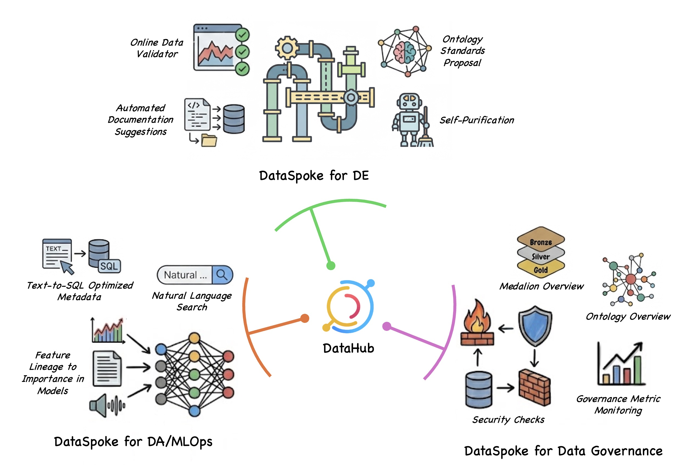

# DataSpoke Baseline

AI Data Catalog Starter: Productized Scaffold to Generate Custom Solutions



---

## 1. Background

### The Need for Custom Solutions

Data catalog solutions (e.g. DataHub, Dataplex, OpenMetadata) offer a vast array of features, yet real-world adoption often falls short of their capabilities. The root cause: by trying to satisfy everyone, they end up optimized for no one.

- Data user groups have diverging needs. Data engineers want to see detailed technical specs and costs of their pipelines. ML engineers and data analysts want metadata rich in domain context for text-to-SQL. Data stewards want to monitor data availability metrics (downtime, etc.) and quality check histories for governance. Security teams want PII usage visibility at a glance. No matter how well-designed a UI may be, maintaining ease of use while serving such diverse purposes is extremely difficult.

- Beyond the UI, users often want domain-specific capabilities. They may need to build custom ML-based data quality modules that run within the catalog, or register unusual data sources that don't fit existing ingestion frameworks.

### New Requirements for Data Catalogs in the AI Era

As LLMs and AI agents are adopted in day-to-day work, data catalogs must go beyond simple metadata repositories and fulfill two critical functions:

- **Online Verifier**: Real-time validation of pipeline development outputs within AI coding loops. By connecting the catalog to the coding loop via RAG or MCP (Model Context Protocol), it enables a TDD-like workflow where data validation tools are set up first, then pipelines are developed against them.

- **Self-Organization & Self-Purification**: AI-driven design of data taxonomies and ontologies, with autonomous consistency checking and correction. As business data grows in complexity, it must be reflected in the enterprise-wide schema in real time, and table/column definitions must be kept up to date as the surrounding environment changes. The data catalog is the most suitable component to perform this purification work.

## 2. Project Definition

This project addresses the custom catalog problem by providing a framework that enables rapid creation of tailored data catalogs using coding agents.

The project name **DataSpoke** comes from treating the existing DataHub as the Hub and defining each specialized extension tailored to an organization's needs as a Spoke — like spokes on a wheel.

This repository delivers two artifacts:

- **Baseline Product** — A pre-built implementation of essential features for an AI-era catalog. Primary target users are Data Engineers (DE), Data Analysts (DA), and Data Governance personnel (DG).
- **AI Scaffold** — A toolkit of consistent conventions, development specs, environment configuration, and Claude Code utilities that enables rapid construction of custom catalogs.

Users can extend features on top of this baseline and leverage the AI Scaffold to run an Agentic Coding Loop.

## 3. Baseline Product

### Core Principles

To prevent the "redundant build" and "inconsistency" problems that arise when catalogs are implemented separately per domain, the following principles are observed:

- **DataHub-backed Backend**: DataHub is used as the mandatory backend to store metadata and serve as the Single Source of Truth (SSOT).
- **API Convention Compliance**: A unified API specification is applied across domains to maintain cross-system consistency.

### System Architecture

DataSpoke consists of four major components:

```
┌───────────────────────────────────────────────┐
│                 DataSpoke UI                  │
└───────────────────────┬───────────────────────┘
                        │
┌───────────────────────▼───────────────────────┐
│                DataSpoke API                  │
│         /api/v1/spoke/[de|da|dg]/...          │
└───────────┬───────────────────────┬───────────┘
            │                       │
┌───────────▼───────────┐ ┌─────────▼───────────┐
│       DataHub         │ │      DataSpoke      │
│    (metadata SSOT)    │ │  Backend / Pipeline │
└───────────────────────┘ └─────────────────────┘

              High Level Architecture
```

- **DataSpoke UI**: Provides a portal-style interface for entering group-specific custom solutions.
- **DataSpoke API**: Features a hierarchical URI structure separated by user group.
- **DataSpoke Backend/Pipeline**: Handles core logic including ingestion, quality validation, and documentation.
- **DataHub**: Stores metadata and serves as the Single Source of Truth (SSOT).

```
┌─────────────────────────────────────────────┐
│  Data Hub & Spokes                   Login  │
│─────────────────────────────────────────────│
│                                             │
│              (DE)                           │
│                 \                           │
│                  \                          │
│                   (Hub)----(DG)             │
│                  /                          │
│                 /                           │
│              (DG)                           │
│                                             │
└─────────────────────────────────────────────┘
                 UI Main Page
```

### Features by User Group

#### Data Engineering (DE) Group

- **Deep Technical Spec Ingestion**: Collects platform-specific in-depth technical metadata such as storage compression formats and Kafka topic replication levels.
- **Online Data Validator**: Performs time-series monitoring and validation of data. Provides an API that can verify whether data passes validation without writing to the actual store, or validate data from past points in time.
- **Automated Documentation Suggestions**:
  - Suggests documentation based on source code references (e.g. GitHub links).
  - Suggests documentation that clearly distinguishes differences between similar tables.
  - Proposes enterprise-wide taxonomy and ontology standards; once approved, suggests modifications based on them.

#### Data Analysis (DA) Group

- **Natural Language Search**: Intuitively explore data tables using natural language queries.
- **Text-to-SQL Optimized Metadata**: Provides curated metadata focused on data content rather than technical specs, enabling AI to generate accurate SQL.
- **Online Data Validator**: Leverages the same functionality as the DE group.

#### Data Governance (DG) Group

- **Enterprise Metrics Time-Series Monitoring**: Manages dashboards tracking dataset counts per platform, total volume, data availability ratios (downtime), and more.
- **Multi-Perspective Data Overview**:
  - Supports taxonomy/ontology graph-based visualization with dataset coloring/sizing by statistics (2D/3D).
  - Supports Medallion Architecture-based dataset overview.

## 4. AI Scaffold

Provides commands and skills for step-by-step development workflows.

- **Development Environment Setup**
  - GitHub clone and reference data setup tools
  - Local Kubernetes cluster-based development environment provisioning tools
- **Development Planning**
  - Feature spec authoring: Define features per user group under the `spec/feature/spoke` directory. Supports draft generation through guided Q&A across domains such as ingestion and quality.
  - Detailed implementation planning: Write work plans under the `spec/impl` directory, considering current implementation state and environment. Receive suggestions for AI coding approaches (Skill, Sub-agent composition, etc.) and reinforce the scaffold accordingly.
